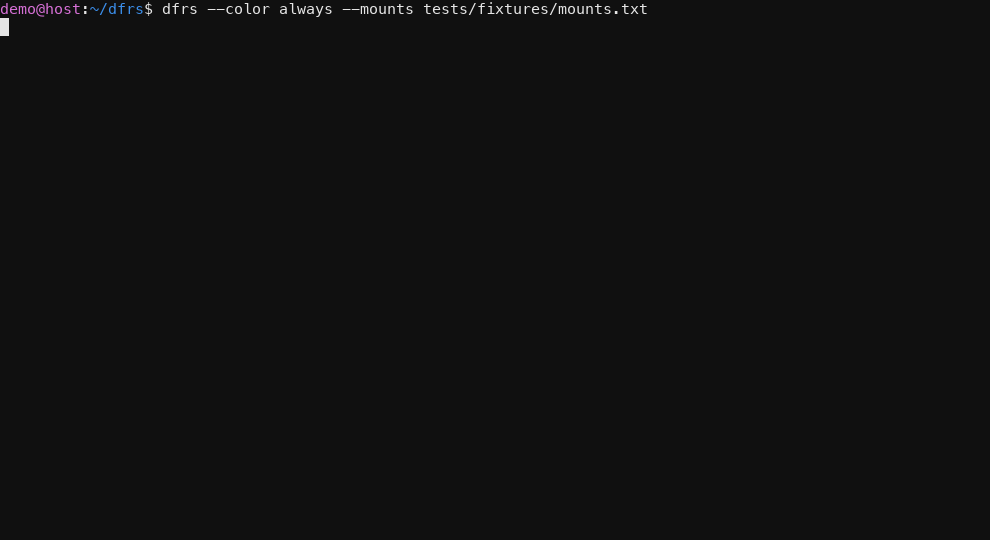

# dfrs

   

Display file system space usage using graphs and colors

*dfrs* displays the amount of disk space available on the file system
containing each file name argument. If no file name is given, the space
available on all currently mounted file systems is shown.

*dfrs*(1) is a tool similar to *df*(1) except that it is able to show a graph
along with the data and is able to use colors.

Without any argument, size is displayed in human-readable format.

Read the [online documentation](https://averyfreeman.github.io/dfrs/) for the
CLI reference, architecture notes, development workflow, and generated
[RustDoc](https://averyfreeman.github.io/dfrs/rustdoc/dfrs/).

The 0.8.1 fork supports macOS arm64 and Linux x86_64/arm64 with Rust 1.96.0.
Windows and Intel macOS are outside this release line.

## Installation

    cargo install dfrs

## License

MIT
